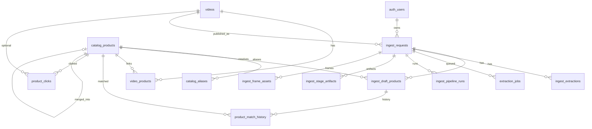
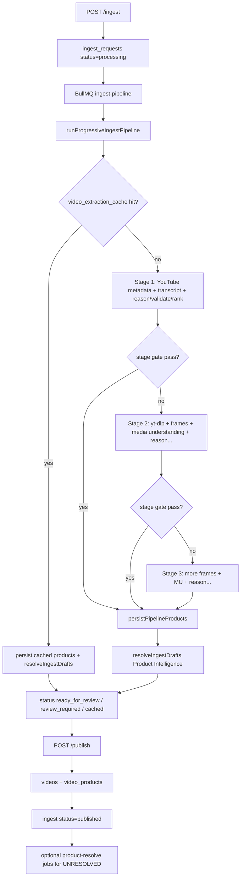

# Mystash Backend — Architecture Inventory

**Scope:** Current system as implemented under `backend/` and related Supabase schema/migrations.  
**Intent:** Complete inventory only. No improvement recommendations.

**Entry points**
- HTTP API: `src/index.ts` (`npm run dev` / `npm start`)
- Ingest worker: `src/worker.ts` (`npm run worker` / `npm run start:worker`)
- Embedded workers: started from `src/index.ts` when `INGEST_WORKER_EMBEDDED !== 'false'`

---

## 1. High-Level Architecture

### 1.1 System context

```text
Expo / Web App
      │  JWT Bearer
      ▼
Express Backend (PORT 8787)
      │
      ├── Supabase (Postgres + Auth + Storage)
      ├── Redis (BullMQ broker only)
      ├── OpenAI (reasoner, vision, scene, commerce GPT)
      ├── Google Cloud Vision (OCR, logos)
      ├── Serper / Google CSE (product search discovery)
      ├── Tavily Extract (merchant page content)
      ├── YouTube (oEmbed, Innertube, timedtext)
      ├── yt-dlp + ffmpeg/ffprobe (Stage 2/3 media)
      └── Optional: Supabase Edge Functions (legacy extraction queue)
```

### 1.2 Services / modules and responsibilities

| Module | Path | Responsibility |
|--------|------|----------------|
| HTTP entry | `src/index.ts` | Health, ingest, manual ingest, publish, product redirect; optionally embeds BullMQ workers |
| Standalone worker | `src/worker.ts` | Starts `ingest-pipeline` worker only |
| Publish | `src/publish.ts`, `src/publishResolveDrafts.ts` | Review → `videos` + `video_products`; reject; enqueue background resolve |
| Manual ingest | `src/manualIngest.ts` | Curator supplies video + 1–5 product URLs; preview enrichment |
| Config | `src/config/pipelineConfig.ts` | Progressive ingest thresholds, models, Redis URL, frame counts, cache key builder |
| Domain (ingest) | `src/domain/types.ts` | Multimodal context, product candidates, evidence, stage types |
| Context | `src/context/ContextBuilder.ts` | Assembles `MultimodalContext` from metadata/transcript/media |
| Stages | `src/stages/*` | Progressive Stage 1→2→3 orchestration and gates |
| Media | `src/media/*` | Frame extraction, storage upload, composite media understanding |
| Providers | `src/providers/*` | OpenAI reasoner/vision/scene; GCP OCR/logo; yt-dlp video download |
| Products (extract) | `src/products/*` | Validate/rank AI candidates; persist drafts |
| Pipeline | `src/pipeline/*` | Platform detect, YouTube context, OpenAI helpers, product link preview, commerce price evidence |
| Pipeline legacy | `src/pipeline/legacy/*` | Pre-progressive Gemini/CSE path (**excluded from `tsconfig` build**) |
| Product Intelligence | `src/product-intelligence/*` | Post-extract resolve: normalize → specificity → catalog → search → enrich → merge → verify/shop |
| Shopping | `src/shopping/*` | Destination selection, outbound redirect, affiliate gate, URL validation |
| Services | `src/services/*` | Extraction cache, stage artifacts, observability events, Tavily HTTP client |
| Workers | `src/workers/*` | BullMQ ingest queue + Redis connection |
| Prompts | `src/prompts/productReasoner.ts` | Stage reasoner system/user prompt text |
| Infra | `src/env.ts`, `src/logger.ts`, `src/supabase.ts` | Env, pino logging, Supabase admin/user clients |

Empty / placeholder directories: `src/routes/` (no route files; all routes in `index.ts`), `src/product-intelligence/affiliate/` (no implementation files).

### 1.3 Dependencies (import direction)

```text
index
  ├── stages/orchestrator
  │     ├── media + providers + products + pipeline/youtubeContext + services
  │     └── product-intelligence (post-persist resolve)
  ├── product-intelligence
  │     ├── search (Serper/CSE + shortlist + enrich strategy)
  │     ├── enrichment → pipeline/productLinkPreview → services/tavily
  │     └── shopping (destination resolution)
  ├── publish / publishResolveDrafts
  └── shopping/productRedirect
```

### 1.4 Primary data flows

1. **URL ingest:** `POST /ingest` → `ingest_requests` → BullMQ `ingest-pipeline` → progressive extract → drafts → Product Intelligence → review → `POST /publish` → `videos` + `video_products`.
2. **Manual ingest:** `POST /ingest/manual` → preview each product URL → drafts → same publish path.
3. **Outbound shopping:** App → `GET /products/:id/redirect` → `ShoppingResolver` → 302 + `product_clicks`.

---

## 2. Folder Structure

### 2.1 Backend root

| Path | Ownership |
|------|-----------|
| `package.json` | Scripts: `dev`→`src/index.ts`, `worker`→`src/worker.ts`, `build`→`tsc`, `start`/`start:worker`→`dist/` |
| `tsconfig.json` | `rootDir: src`, `outDir: dist`; excludes `src/pipeline/legacy/**` |
| `.env` / `.env.example` | Runtime configuration |
| `dist/` | Compiled JS |
| `docs/` | Architecture and related backend docs |
| `android/` | Expo/Android tooling (not part of Express runtime) |

### 2.2 `backend/src/` ownership

```text
src/
  index.ts, worker.ts, publish.ts, publishResolveDrafts.ts, manualIngest.ts
  env.ts, logger.ts, supabase.ts, stageLog.ts
  config/                 Pipeline env config + cache key
  context/                MultimodalContext assembly
  domain/                 Ingest-domain TypeScript types
  media/                  Frames, media-understanding composite, frame storage
  pipeline/               YouTube, OpenAI helpers, link preview, detect/embed
    legacy/               Pre-progressive Gemini path (not in tsc build)
  product-intelligence/   Catalog commerce backbone (post-extract)
    catalog/              Supabase catalog + search-candidate + match-history repos
    enrichment/           Merchant extract/normalize/validate/merge/trust policy
    interfaces/           Repository / provider contracts
    jobs/                 product-resolve BullMQ queue/worker
    matcher/              MatchScorer (draft vs candidate)
    normalizer/           ProductNormalizer + identity canonicalizer
    resolver/             ProductResolver orchestration
    scoring/              Candidate decision scores
    search/               Query build, Serper/CSE, shortlist, PDP classify/rank
    specificity/          Searchability gate
    domain/               PI TypeScript types
    affiliate/            Empty placeholder
  products/               Extract-time validate/rank/persist
  prompts/                LLM prompt strings
  providers/              Pluggable OCR/logo/vision/scene/reasoner/video
  routes/                 Empty
  services/               Cache, artifacts, observability, Tavily client
  shopping/               Shopping destination + redirect + affiliate gate
  stages/                 Progressive orchestrator (+ stage stub files)
  workers/                BullMQ ingest queue/worker/redis
```

Stage stub files (`stage0Accept.ts`, `stage1TextPath.ts`, `stage2EnrichPath.ts`, `stage3DeepPath.ts`) document intent; real logic lives in `orchestrator.ts`.

---

## 3. Database

Schema lives primarily in `supabase/migrations/`. Express uses the Supabase service-role client for writes. The Expo app reads selected public/owner tables.

### 3.1 Entity relationship (core)



### 3.2 Table inventory

#### `videos`
- **Purpose:** Published curator reels for the app feed.
- **Owner:** Publish path / app feed.
- **Relationships:** Parent of `video_products`; optional target of `ingest_requests.video_id` and `product_clicks.video_id`.
- **Writes:** `publish.ts`, edge `publish-ingest`, app CRUD helpers.
- **Reads:** App feed; `productRedirect.ts` (curator metadata).

#### `ingest_requests`
- **Purpose:** Curation ingest lifecycle for a source URL.
- **Owner:** Ingest API + orchestrator.
- **Key columns:** `user_id`, `source_url`, `platform`, `status`, `video_id`, `video_title`, `thumbnail`, `video_description`, `video_description_source`, `video_creator`.
- **Relationships:** Parent of drafts, extractions, jobs, pipeline runs/artifacts/frames.
- **Writes:** `index.ts`, `productPersist.ts`, `orchestrator.ts`, `manualIngest.ts`, legacy/edge extractors, `publish.ts`.
- **Reads:** Same writers; Product Intelligence; app `src/services/curation.ts`.

#### `ingest_draft_products`
- **Purpose:** Extracted product candidates pending review; resolution fields link to catalog.
- **Owner:** Extract persist + ProductResolver.
- **Relationships:** → `ingest_requests`, → `catalog_products`; referenced by `product_match_history`.
- **Writes:** `productPersist.ts`, `manualIngest.ts`, `ProductResolver.ts`, `publish.ts`, resolve worker.
- **Reads:** Ingest status APIs, PI, resolve queue, app curation UI.

#### `video_products`
- **Purpose:** Products attached to a published feed video (denormalized + catalog FK).
- **Owner:** Publish path.
- **Relationships:** → `videos`, → `catalog_products`.
- **Writes:** `publish.ts`, `productResolveQueue.ts` (post-resolve sync), edge publish.
- **Reads:** App feed joins.

#### `ingest_extractions`
- **Purpose:** Snapshot of extraction payloads / pipeline meta.
- **Owner:** Persist path.
- **Writes:** `productPersist.ts`, `manualIngest.ts`, legacy/edge executors.
- **Reads:** Duplicate-ingest reuse in `index.ts`; app curation.

#### `ingest_pipeline_runs`
- **Purpose:** Progressive multimodal run tracking.
- **Owner:** `orchestrator.ts`.
- **Status values:** `running` | `ready_for_review` | `review_required` | `failed` | `cached`.
- **Writes/Reads:** Orchestrator.

#### `ingest_stage_artifacts`
- **Purpose:** Per-stage observability payloads (input/output summaries, tokens, cost).
- **Owner:** `services/stageArtifacts.ts`.
- **Writes:** Orchestrator via stageArtifacts helper.
- **Reads:** Operational/debug queries (no dedicated API reader in backend).

#### `ingest_frame_assets`
- **Purpose:** Frame evidence metadata for Stage 2/3; paths into Storage bucket `ingest-frames`.
- **Owner:** Orchestrator + `media/frameStorage.ts`.
- **Writes:** Orchestrator upsert; uploads via frameStorage.
- **Reads:** No dedicated consumer beyond write path.

#### `video_extraction_cache`
- **Purpose:** Skip AI re-extraction for same platform/video/pipeline/provider versions.
- **Owner:** `services/extractionCache.ts` / orchestrator.
- **Key:** `{platform}:{externalVideoId}:{pipelineVersion}:{providerVersion}:{EXTRACTION_CONTEXT_VERSION}`.
- **Writes/Reads:** Extraction cache service used by orchestrator (YouTube path).

#### `canonical_products`
- **Purpose:** Deduplicated product-page preview cache by tracking-stripped URL.
- **Owner:** `pipeline/productLinkPreview.ts`.
- **Key columns:** `canonical_url`, `name`, `price`, `currency`, `image`, `last_extracted_at`, `extraction_source` (`scrape` | `ai` | `scrape_currency_v2` | `ai_currency_v2`).
- **Writes/Reads:** productLinkPreview only.

#### `catalog_products`
- **Purpose:** Global product catalog — commerce source of truth.
- **Owner:** Product Intelligence catalog repository (+ publish placeholders).
- **Key columns:** identity (`canonical_slug`, brand/name/model), commerce (`merchant_url`, `preferred_shopping_url`, `affiliate_url`, `shopping_provider`, price/currency), verification (`verification_status`, provider/source/version), `metadata` jsonb, `status`.
- **Relationships:** Aliases, drafts, video_products, match history, clicks; self-FK `merged_into_id`.
- **Writes:** `SupabaseCatalogRepository`, `publish.ts`.
- **Reads:** Catalog repo, publish, redirect, app joins.

#### `catalog_aliases`
- **Purpose:** Alternate names → catalog product.
- **Owner:** `SupabaseCatalogRepository`.
- **Writes/Reads:** `findByAlias`, `addAlias`.

#### `catalog_search_candidates`
- **Purpose:** Normalized discovery-candidate cache (not raw Serper JSON).
- **Owner:** `SupabaseSearchCandidateCache`.
- **Key:** `(query, provider)` with `expires_at`.
- **Writes/Reads:** Serper/CSE providers via cache interface.

#### `catalog_search_debug`
- **Purpose:** Optional raw provider payload storage for debugging.
- **Owner:** Schema only.
- **Writes/Reads:** No `.from('catalog_search_debug')` usage found.

#### `product_match_history`
- **Purpose:** Audit of draft↔catalog match decisions.
- **Owner:** `SupabaseMatchHistoryWriter`.
- **Writes:** ProductResolver finish path.
- **Reads:** None found in app/API.

#### `product_clicks`
- **Purpose:** Shopping redirect analytics before outbound 302.
- **Owner:** `shopping/productRedirect.ts`.
- **Writes:** productRedirect.
- **Reads:** Analytics sink (no backend reader).

#### `extraction_jobs`
- **Purpose:** Legacy/edge async extraction queue (pending → processing → completed/failed/dead_letter).
- **Owner:** Edge ingest + extraction executors; claimed via RPC `claim_extraction_jobs`.
- **Writes/Reads:** Edge `ingest-url`, `process-extraction-queue`, shared/legacy extractionExecutor.
- **Note:** Express progressive path uses BullMQ, not this table.

#### `extraction_cache`
- **Purpose:** Legacy content-hash extraction cache.
- **Owner:** Legacy/edge `extractionExecutor`.
- **Writes/Reads:** Same (excluded from current `tsc` build for backend legacy folder).

#### `gemini_rate_state`
- **Purpose:** Singleton (id=1) OpenAI/Gemini 429 backoff state.
- **Owner:** `pipeline/openaiRateLimit.ts` (+ edge geminiRateLimit).
- **Writes/Reads:** Rate-limit helpers.

#### `affiliate_links`
- **Purpose:** Affiliate URL cache table.
- **Owner:** Schema only today.
- **Writes/Reads:** No `.from('affiliate_links')` usage; affiliate gate uses catalog `affiliate_url` fields.

#### `moderation_actions`
- **Purpose:** Audit log of curator actions (publish/reject/etc.).
- **Owner:** `publish.ts` (+ edge publish).
- **Writes:** Publish path.
- **Reads:** None found.

### 3.3 RPC / storage

| Resource | Purpose | Callers |
|----------|---------|---------|
| `claim_extraction_jobs(p_worker, p_limit)` | `SKIP LOCKED` claim of `extraction_jobs` | Edge `process-extraction-queue` only |
| Storage bucket `ingest-frames` | Private JPEG frames (5MB); signed URLs (7-day TTL) | `media/frameStorage.ts` |

### 3.4 RLS patterns (summary)

| Pattern | Tables |
|---------|--------|
| Public `SELECT` | `videos`, `video_products`, `catalog_products` (`ACTIVE` only) |
| Owner `SELECT` | `ingest_requests`, `ingest_draft_products` (via parent) |
| Service-role only (RLS on, no client policies) | Pipeline caches, artifacts, frames, match history, clicks, rate state, extraction queue/cache, aliases, search candidates, etc. |

---

## 4. Domain Models

### 4.1 Progressive ingest (`src/domain/types.ts`)

| Type | Role |
|------|------|
| `EvidenceSource` | `VISION` \| `OCR` \| `LOGO` \| `SCENE` \| `TRANSCRIPT` \| `METADATA` |
| `DetectedObject` / `DetectedLogo` / `SceneInfo` / `ActivityInfo` / `OcrLine` | Media-understanding facts |
| `FrameRef` | Frame index, timestamp, storage path |
| `MediaUnderstandingResult` | Aggregated objects/OCR/logos/scene/activities/frames |
| `MultimodalContext` | Platform, source, metadata, transcript, media, pipeline/provider versions |
| `ProductEvidence` | Summary, frames, logoHits, transcript/ocr mention flags |
| `ProductCandidate` | Name/category/brand/model/confidence/sources/price/currency/urls/evidence |
| `StagePassResult` | Gate pass/fail for progressive stages |
| `PipelineRunStatus` / `TokenUsage` / `ProviderCallMeta` | Run observability |

### 4.2 Product Intelligence (`src/product-intelligence/domain/types.ts`)

| Type | Role |
|------|------|
| `CatalogStatus` | `ACTIVE` \| `DISCONTINUED` \| `MERGED` \| `HIDDEN` |
| `VerificationStatus` | `VERIFIED` \| `UNVERIFIED` \| `UNRESOLVED` |
| `SourceType` / `PageType` / `PageCapabilities` | Candidate classification + contribution capabilities |
| `CandidateClassification` | Combined source/page/capabilities (+ legacy page-type projection) |
| `NormalizedProduct` | Canonical identity after `ProductNormalizer` |
| `SearchCandidate` | Discovery/enrichment candidate with commerce + enrichment meta |
| `SearchResult` | `Succeeded` \| `Failed` discriminated union |
| `CatalogProduct` / `CreateCatalogInput` / `UpdateCatalogInput` | Catalog persistence shapes |
| `AiDraftInput` | Draft row projection into resolver |
| `ResolveDraftResult` | Resolver decision output |
| `MatchScoreResult` | Draft↔candidate scoring |

### 4.3 Enrichment / merge (`product-intelligence/enrichment`)

| Type | Role |
|------|------|
| `MerchantProductMetadata` | Normalized PDP extract (title, brand, images, price, currency, specs, completeness) |
| `Offer` | Atomic commerce bundle: price, currency, availability, merchant, URLs, offerId |
| `MergedProductMetadata` | Field-merged product with provenance maps and evidence |

### 4.4 Shopping

| Type / concept | Role |
|----------------|------|
| Shopping destination | `preferredShoppingUrl` + `shoppingProvider` from offer ranking |
| Redirect destination types | `affiliate` \| `preferred` \| `merchant` (logged on clicks) |

### 4.5 Runtime persistence entities (tables as domain)

Ingest request → draft products → (optional) catalog product → published video + video products → outbound clicks.

---

## 5. Background Jobs

### 5.1 Queue: `ingest-pipeline`

| Item | Value |
|------|-------|
| Queue name | `ingest-pipeline` |
| Queue file | `src/workers/queue.ts` |
| Worker file | `src/workers/ingestPipelineWorker.ts` |
| Entrypoints | `src/worker.ts`; also embedded from `src/index.ts` |
| Job name | `run` |
| Job id | `ingest-${ingestRequestId}` |
| Payload | `{ ingestRequestId, traceId }` |
| Processor | `runProgressiveIngestPipeline(admin, ingestRequestId, traceId)` |
| Attempts | 3 |
| Backoff | Exponential, delay 4000 ms |
| removeOnComplete / Fail | 100 / 200 |
| Concurrency | 2 |
| Redis | `REDIS_URL` via `getBullmqConnection()` |

On enqueue failure, `index.ts` falls back to `setImmediate(runProgressiveIngestPipeline(...))`.

### 5.2 Queue: `product-resolve`

| Item | Value |
|------|-------|
| Queue name | `product-resolve` |
| File | `src/product-intelligence/jobs/productResolveQueue.ts` |
| Worker start | `startProductResolveWorker` from `index.ts` (embedded); **not** started by `worker.ts` |
| Job name | `resolve` |
| Job id | `resolve-${draftId}` |
| Payload | `{ draftId, ingestId, videoProductId?, traceId? }` |
| Processor | Load draft → `createProductIntelligence` → `resolveIngest` → sync `video_products` |
| Attempts | 5 |
| Backoff | Exponential, delay 8000 ms |
| removeOnComplete / Fail | 100 / 200 |
| Concurrency | 2 |

**Enqueue sources:** ProductResolver (search failure + background flag), `publish.ts` (UNRESOLVED published products), factory wiring via `resolveIngestDrafts`.

### 5.3 Legacy DB job queue (non-BullMQ)

`extraction_jobs` + RPC `claim_extraction_jobs` used by Supabase Edge `process-extraction-queue`. Not used by the Express progressive orchestrator path.

---

## 6. External Services

| Service | Env / config | Role | Primary call sites |
|---------|--------------|------|--------------------|
| **Supabase** | `SUPABASE_URL`, `SUPABASE_ANON_KEY`, `SUPABASE_SERVICE_ROLE_KEY` | Auth, Postgres, Storage | `supabase.ts` and nearly all persistence |
| **Redis** | `REDIS_URL` | BullMQ broker only | `workers/redisConnection.ts` |
| **OpenAI** | `OPENAI_API_KEY`, `OPENAI_REASONER_MODEL`, `OPENAI_VISION_MODEL`, `OPENAI_MODEL` | Reasoner, vision, scene, Tavily→GPT commerce extract | `providers/reasoner|vision|scene`, `productLinkPreview.ts` |
| **Google Cloud Vision** | `GOOGLE_APPLICATION_CREDENTIALS`, `GCP_VISION_ENABLED` | OCR + logo detection | `GoogleVisionOcrProvider`, `GoogleVisionLogoProvider` |
| **Serper** | `SERPER_API_KEY`, `PRODUCT_SEARCH_PROVIDER=serper` | Organic product discovery | `SerperSearchProvider.ts` → `google.serper.dev/search` |
| **Google Custom Search** | `GOOGLE_CSE_API_KEY`, `GOOGLE_CSE_ID` | Alternate discovery provider | `GoogleCustomSearchProvider.ts` |
| **Tavily Extract** | `TAVILY_API_KEY` | Merchant page raw content + images | `services/tavily.ts` → `api.tavily.com/extract` |
| **YouTube oEmbed** | none | Title/author/thumbnail | `youtubeContext.ts`, `manualIngest.ts` |
| **YouTube Innertube** | none | Description, captions tracks, player metadata | `youtubeContext.ts` (`youtubei/v1/player`) |
| **YouTube timedtext** | none | Direct transcript fetch | `youtubeContext.ts` |
| **Instagram oEmbed** | none | Manual-ingest metadata for IG URLs | `manualIngest.ts` |
| **yt-dlp** | CLI on PATH | Stage 2/3 video download | `YtDlpVideoProvider.ts` |
| **ffmpeg / ffprobe** | CLI on PATH | Adaptive frame extraction + duration probe | `media/FrameExtractor.ts` |
| **Gemini (legacy)** | keys inside legacy files | Old extract/vision path | `pipeline/legacy/*` (not in current build) |

**Affiliate networks (Cuelinks/Impact):** Configured via `AFFILIATE_ENABLED` / `AFFILIATE_PROVIDER` in `shopping/affiliateConfig.ts`. Runtime uses catalog `affiliateUrl` when enabled; minting stub exists in `pipeline/affiliate.ts` (“not wired yet”).

---

## 7. Existing APIs

All Express routes are declared in `src/index.ts`. Default listen: `PORT` or **8787**, host `0.0.0.0`.

### 7.1 Ops

| Method | Path | Auth | Purpose |
|--------|------|------|---------|
| `GET` | `/health` | None | Liveness `{ ok: true }` |

### 7.2 Ingest / curation

| Method | Path | Auth | Purpose |
|--------|------|------|---------|
| `POST` | `/ingest` | Bearer JWT | Create/reuse `ingest_requests`; enqueue progressive extract; return status/drafts |
| `POST` | `/ingest/manual` | Bearer JWT | Video URL + 1–5 product URLs; preview enrichment → drafts |

### 7.3 Publish / moderation

| Method | Path | Auth | Purpose |
|--------|------|------|---------|
| `POST` | `/publish` | Bearer JWT | Select drafts → create `videos`/`video_products`, or `reject_all`; write moderation actions |

### 7.4 Shopping / commerce

| Method | Path | Auth | Purpose |
|--------|------|------|---------|
| `GET` | `/products/:id/redirect` | Optional JWT (for click user id) | Resolve outbound URL; log `product_clicks`; HTTP 302 |

Auth pattern for protected routes: `Authorization: Bearer` → `createSupabaseUserClient` → `auth.getUser()`.

There is no dedicated recommend/feed HTTP API in the backend; the Expo app reads `videos` / `video_products` / `catalog_products` directly from Supabase.

---

## 8. Current Caches

| Cache | Storage | Identity | Freshness | Read path | Write path |
|-------|---------|----------|-----------|-----------|------------|
| Video extraction cache | `video_extraction_cache` | `platform:videoId:pipelineVersion:providerVersion:youtube-metadata-v2` | Versioned key (no TTL column) | Orchestrator YouTube start | After successful extract |
| Search candidate cache | `catalog_search_candidates` | `(query, provider)` | `SEARCH_CACHE_TTL_HOURS` (default 168h) via `expires_at` | Serper/CSE providers | Same providers (replace rows) |
| Canonical product preview | `canonical_products` | `canonical_url` | 24h `last_extracted_at` **and** `extraction_source` ∈ `{scrape_currency_v2, ai_currency_v2}` | `productLinkPreview.loadFreshCanonical` | Upsert on scrape/AI success |
| Legacy extraction cache | `extraction_cache` | content hash | Legacy executor | Legacy/edge only | Legacy/edge only |
| Pipeline config singleton | In-process memory | module singleton | Process lifetime | `getPipelineConfig()` | Lazy init / `resetPipelineConfigCache()` |
| Signed frame URLs | Supabase Storage | object path | 7 days | `frameStorage.ts` | On upload |
| Affiliate cache TTL config | Config only (`AFFILIATE_CACHE_TTL_DAYS`) | — | Exposed as ms | No read/write store usage found | — |
| Redis | Redis | BullMQ keys | Queue broker | Workers | Workers |

---

## 9. Search-Related Logic Already Present

Owned by `src/product-intelligence/search/` (+ catalog search-candidate cache).

### 9.1 Query construction
- `ProductSearchQueryBuilder.buildProductSearchQuery`
- Inputs: brand, name, model, logo hits, numeric/SKU-ish multimodal tokens, optional category
- Token cleanup: `QueryNormalizer` + `ProductIdentityCanonicalizer` (strips content descriptors like ASMR/unboxing/review)
- Bound to max 6 terms

### 9.2 Discovery providers
- Default: `SerperSearchProvider` (`PRODUCT_SEARCH_PROVIDER=serper`)
- Alternate: `GoogleCustomSearchProvider`
- Discovery results are candidate URLs/titles/snippets; Serper images are stripped before enrichment (catalog truth comes from page extract)

### 9.3 Strategy
- Factory wires `TavilyEnrichedPdpSearchStrategy`:
  1. Discovery
  2. Shortlist (`CandidateShortlister` + `PdpRanker` + `classifyCandidatePage` + `MetadataEnrichmentAdmissionPolicy`)
  3. Parallel merchant enrichment (`MerchantEnrichmentService` / Tavily extractor / `previewProductLink`)
  4. Post-enrich `classifyPdp`
- Cap: `METADATA_ENRICH_MAX_CANDIDATES` (1–10, default 5)

### 9.4 Classification / ranking helpers
- `CandidatePageClassifier` + `CandidateCapabilityRegistry` (source/page/capabilities)
- `PdpClassifier`, `PdpRanker`
- `CandidateScoring` (metadataScore / shoppingScore / sourceAuthority)
- `pdpSearchHints` AsyncLocalStorage for brand/name/category during enrich

### 9.5 Local catalog search
- `LocalCatalogSearch` over aliases / normalized name / brand+model before external search

### 9.6 Unused / alternate in tree
- `DefaultSearchStrategy` exists but factory uses `TavilyEnrichedPdpSearchStrategy`
- Legacy Google CSE verify helpers under pipeline legacy

---

## 10. Recommendation-Related Logic Already Present

**No dedicated recommendation / personalized feed / for-you subsystem exists in `backend/src`.**

Related ranking that *does* exist (not user-recommendation):
- Extract-time product dock order: `products/ProductRanker.ts`
- Commerce/metadata candidate scoring: `CandidateScoring`, `PdpRanker`, shopping provider priority
- Manual curation path: `POST /ingest/manual` (human-supplied product URLs)

App feed ranking (e.g. `stash_score` on `videos`) is stored/read via Supabase from the client, not computed by a backend recommend service.

---

## 11. Product Intelligence Pipeline

### 11.1 Factory
`product-intelligence/factory.ts` → `createProductIntelligence(admin, ingestId, background?, traceId?)`  
Returns `{ resolver, enrichment }` or `null` if `PRODUCT_INTELLIGENCE_ENABLED=false`.

Wired components:
- `SupabaseCatalogRepository`
- `SupabaseSearchCandidateCache`
- Discovery provider (Serper or CSE)
- `MerchantEnrichmentService(TavilyMerchantExtractor)`
- `TavilyEnrichedPdpSearchStrategy`
- `SupabaseDraftUpdater`
- `SupabaseMatchHistoryWriter`
- Background enqueue → `product-resolve` queue

### 11.2 Resolver flow (`ProductResolver.resolveOne`)

1. **Normalize** — `ProductNormalizer` (+ identity canonicalization)
2. **Specificity** — `scoreProductSpecificity`; non-searchable → `UNVERIFIED` (`ai_specificity_gate`)
3. **Local catalog hit** — if score ≥ `CATALOG_HIT_MIN_SCORE` and `VERIFIED` → reuse (`local_hit`)
4. **External search** — build query → discovery + enrich strategy
5. **Search failure** — `UNRESOLVED` placeholder; may enqueue background resolve
6. **Empty / weak results** — AI fallback `UNVERIFIED`
7. **Metadata candidate filter** — `enrichmentSucceeded` + MatchScorer ≥ verification min
8. **Commerce subset** — `capabilities.commerce` + `pdpVerdict === 'pdp'` + classifier min
9. **Merge** — `MetadataMergeService` + `FIELD_TRUST_POLICY` (atomic `offer`, field-level metadata, evidence deep-merge)
10. **Verification merchant URL** — authority-first pick
11. **Shopping destination** — `resolveShoppingDestination`
12. **Upsert catalog + update draft + match history** — `VERIFIED` if commerce offers exist; else metadata-only `UNVERIFIED`

### 11.3 Enrichment internals
- `previewProductLink`: canonical cache → HTML scrape (OG/JSON-LD/loose symbols) → Tavily Extract + GPT fallback
- Currency evidence: `CommercePriceEvidence` inspects raw price text vs reported currency; rejects unsupported/mismatched pairs
- `MerchantMetadataNormalizer` / `MerchantMetadataValidator` / completeness scoring

### 11.4 Post-extract hook
`resolveIngestDrafts` (`product-intelligence/index.ts`) runs after orchestrator persist (and from resolve worker / publish paths).

---

## 12. Shopping Resolution Pipeline

| Piece | Path | Behavior |
|-------|------|----------|
| Offer ranking (PI) | `ShoppingDestinationResolver.ts` | Score commerce-capable offers; set `preferredShoppingUrl` + `shoppingProvider` |
| Verification URL (separate) | same module | Authority-first merchant URL for verification provenance |
| Provider priority | `shoppingPriorityConfig.ts` | Default / env `SHOPPING_PROVIDER_PRIORITY`: `amazon,official,flipkart,myntra,ajio,bestbuy,merchant` |
| Host classifiers | shoppingPriorityConfig | amazon / flipkart / myntra / ajio / nykaa / bestbuy / walmart / target / decathlon / rei |
| Outbound click resolve | `ShoppingResolver.ts` | Order: affiliate (if enabled + URL) → preferred → merchant |
| Affiliate gate | `AffiliateService.ts` + `affiliateConfig.ts` | Default disabled; uses existing catalog affiliate URL when enabled |
| Redirect API | `productRedirect.ts` | `GET /products/:id/redirect` + `product_clicks` |
| URL validation | `shopping/urlValidation.ts` | Safety checks used by publish/redirect paths |
| Affiliate mint stub | `pipeline/affiliate.ts` | Planned Cuelinks→Impact chain; not minting in production path |

Shopping destination selection is **independent** of atomic offer merge: catalog may store an offer’s price/currency from one merchant URL while `preferredShoppingUrl` is chosen by shopping-score / provider priority.

---

## 13. Event Flow: Upload Until Publish

### 13.1 Sequence



### 13.2 Stage 1 details (YouTube)
1. `gatherYoutubeContext` — oEmbed + Innertube description + transcript sources
2. Persist title/description/creator/thumbnail on `ingest_requests`
3. `ContextBuilder` — metadata + transcript; `media: null`
4. OpenAI reasoner → ProductValidator → ProductRanker
5. Gate: confidence/product-count thresholds (`stagePass`)

### 13.3 Stage 2 / 3 (when gate fails)
- Download via yt-dlp
- Adaptive ffmpeg frames → upload `ingest-frames` → `ingest_frame_assets`
- Composite media understanding (OpenAI vision + GCP OCR/logo + OpenAI scene)
- Rebuild context with media; reason/validate/rank again

### 13.4 Persist + PI
- Insert `ingest_draft_products` + `ingest_extractions`
- Set ingest status to `processing` until PI completes, then publishable status
- `resolveIngestDrafts` per draft under `pdpSearchHints` ALS

### 13.5 Publish
- Curator selects included drafts (or reject_all)
- Insert `videos` + `video_products`
- Link `ingest_requests.video_id`, status `published`
- Write `moderation_actions`
- Enqueue `product-resolve` for unresolved catalog links when needed

### 13.6 Observed status values

**`ingest_requests.status`:** `processing` → `ready_for_review` | `review_required` (| cache-applied) → `published` | `rejected`  
(Also schema/legacy values: `draft`, `queued`, `failed`.)

**Draft `resolution_status`:** starts `UNRESOLVED` on persist; PI sets `VERIFIED` | `UNVERIFIED` | `UNRESOLVED`.

### 13.7 Observability events
Emitted via `emitPipelineEvent` (`services/observability.ts`), including:
`ingest.started`, `cache.hit`, `metadata.complete`, `transcript.complete`, `reasoning.context.ready`, `context.built`, `reasoning.complete`, `validate.complete`, `rank.complete`, `stage.gate`, `media_understanding.*`, `catalog.match.complete`, `ingest.complete`, plus Product Intelligence events (`search.query_built`, `metadata.enrichment.*`, `metadata.merge.completed`, `verification.decided`, `offer.extraction.raw`, etc.).

Artifacts: `ingest_pipeline_runs`, `ingest_stage_artifacts`, `ingest_frame_assets`.

---

## Appendix A — Config entrypoints

| Area | File |
|------|------|
| Progressive pipeline | `src/config/pipelineConfig.ts` |
| Product Intelligence | `src/product-intelligence/config.ts` |
| Affiliate | `src/shopping/affiliateConfig.ts` |
| Shopping priority | `src/shopping/shoppingPriorityConfig.ts` |
| Env surface | `.env.example` |

## Appendix B — Related Edge Functions (outside Express build)

Present under `supabase/functions/` and still relevant to the overall system:
- `ingest-url` — may enqueue `extraction_jobs`
- `process-extraction-queue` — claims jobs via RPC
- Shared extractors (`_shared/extractionExecutor.ts`, pipeline* mirrors)
- `publish-ingest` — alternate publish path

The Express progressive orchestrator is the local/dev primary path documented above; Edge functions remain part of the deployed Supabase surface.

---

*Document generated as an inventory of the current codebase and schema. No recommendations included.*
